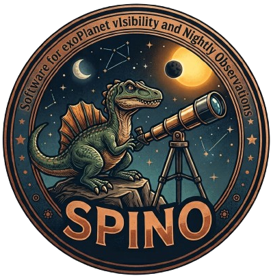

Welcome to SPINO's Documentation!
==================================

|

.. image:: https://img.shields.io/badge/GitHub-SPINO-181717.svg?logo=github
   :target: https://github.com/francescoa97outlook/SPINO
   :alt: Source code on GitHub

.. image:: https://img.shields.io/badge/License-GPLv3-blue.svg
   :target: https://www.gnu.org/licenses/gpl-3.0
   :alt: License: GPL v3

.. image:: https://readthedocs.org/projects/spino/badge/?version=latest
   :target: https://spino.readthedocs.io/en/latest/?badge=latest
   :alt: Documentation Status

.. image:: https://img.shields.io/pypi/v/spino.svg
   :target: https://pypi.org/project/spino/
   :alt: PyPI version

|

**SPINO** (Software for exoPlanet vIsibility and Nightly Observations) is a
self-contained Tkinter desktop application for planning exoplanet
**transit / secondary-eclipse phase-coverage** observations. It wraps a
scientific scheduling pipeline --- catalog loading, desert filtering, per-planet
visibility, TSM/ESM ranking, and telluric-overlap plots --- behind an editable
graphical interface, so every parameter that used to live in a Python config
file is now a form field.

The widget/panel/theming layer is reused from the
`GUIBRUSHR <https://www.ict.inaf.it/gitlab/guibrushr/guibrushr>`_ project; the
scheduling pipeline is bundled in ``src/spino/pipeline/``. The whole thing is
standalone: all Python modules and data files it needs are vendored into the
package, so it runs offline out of the box.

Key Features
------------

* **Every config parameter is editable in the GUI** --- catalog source, desert /
  extra filters, observatory (telescope + instrument + site), proposal window,
  observing & event-coverage constraints, hand-entered custom planets, the
  telluric-overlap plot grid, and all output / landscape settings.
* **One-click run** of the pipeline in a background subprocess, with the live
  log streamed into the window and a **Stop** button.
* **Generated PDFs / CSVs listed** in the app; double-click to open them in your
  system viewer.
* **Save / Load presets** as JSON, and **Reset to defaults**.
* Bundled NASA Exoplanet Archive catalog cache, desert-boundary / KDE aux files,
  and a sky-transmission FITS.

.. toctree::
   :maxdepth: 2
   :caption: User Guide

   installation
   usage
   configuration
   architecture
   credits

.. toctree::
   :maxdepth: 2
   :caption: API Reference

   modules

License
-------

SPINO is free software distributed under the GNU General Public License v3.0 or
later. It reuses GUI widget code from **GUIBRUSHR**, which is GPLv3; as a
derivative work SPINO is therefore also GPLv3. See
`GNU GPL v3.0 <https://www.gnu.org/licenses/>`_ for details.

Author & Contact
----------------

**Francesco Amadori** --- francesco.a97.ing@outlook.it

For questions, bug reports, or technical assistance, please use the
`GitHub repository <https://github.com/francescoa97outlook/SPINO>`_.

Indices and Tables
==================

* :ref:`genindex`
* :ref:`modindex`
* :ref:`search`
